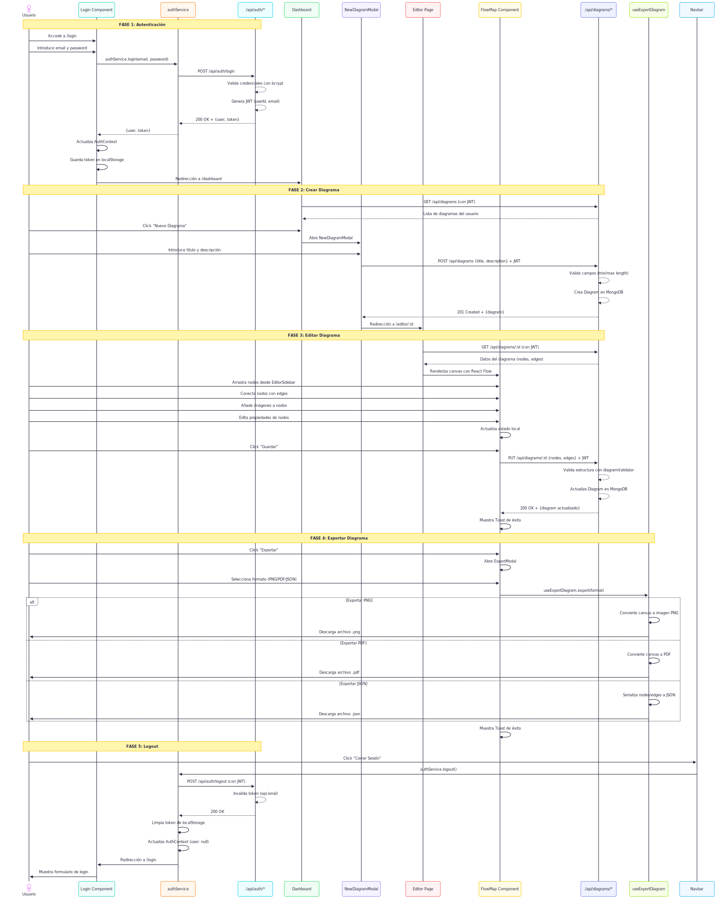

# Arquitectura técnica

## Diagrama de la arquitectura



Para ver y visualizar mejor los componentes de la arquitectura accede al siguiente enlace -> [enlace](https://www.mermaidchart.com/d/866864e7-dd42-4dbc-88b3-78e10a11667b)

### Documentación de la arquitectura

#### Frontend (React + Nginx)
- **Nginx**: Servidor web que sirve archivos estáticos y actúa como proxy reverso
- **React SPA**: Aplicación de página única construida con Vite
- **React Flow**: Librería para el editor de diagramas interactivo
- **Context API**: Estado global (autenticación, notificaciones)
- **Servicios**: Capa de abstracción para llamadas API

#### Backend (Node.js + Express)
- **Express Server**: Framework web minimalista
- **Middleware**: Funciones transversales (auth, CORS, errores)
- **Rutas**: Definición de endpoints REST
- **Controladores**: Lógica de negocio por funcionalidad
- **Modelos**: Esquemas de Mongoose con validaciones
- **Validadores**: Validaciones personalizadas complejas
- **Servicios**: Servicios externos (email)

#### Base de Datos (MongoDB)
- **MongoDB 4.4**: Base de datos NoSQL
- **Colecciones**: Users, Diagrams
- **Mongoose**: ODM para modelado y validación

#### Seguridad
- **JWT**: Tokens de autenticación stateless
- **bcrypt**: Hash de contraseñas con salt
- **Validaciones**: Capas de validación

#### Docker
- **Docker Compose**: Levanta y maneja 3 servicios
- **Red**: Se usa `app-network` para comunicación interna
- **Volumes**: Persistencia de datos MongoDB

## Decisiones Técnicas Clave

### 1. Stack MERN
JavaScript full-stack, desarrollo rápido, esquema flexible (MongoDB) para diagramas variables, ecosistema rico.

### 2. Docker + Docker Compose
Consistencia entre desarrollo y producción, aislamiento de servicios, despliegue simple con `docker-compose up`.

### 3. JWT para Autenticación
Stateless (escalabilidad horizontal), no requiere almacenar sesiones en servidor, cross-domain ready.

### 4. React Flow para Editor
Componentes declarativos, drag & drop built-in, nodos personalizables, performance optimizado.

### 5. MongoDB con Nodos Embebidos
Diagramas completos en una query, atomicidad, esquema flexible para evolución rápida.

### 6. Nginx como Proxy Reverso
Alto rendimiento para archivos estáticos, proxy a backend elimina CORS en producción, SSL centralizado.


## Estructura del Proyecto

```
BossFlow/
│
├── backend/                          # API REST (Node.js + Express)
│   ├── config/
│   │   └── database.js              # Conexión MongoDB con Mongoose
│   ├── controllers/                 # Lógica de negocio
│   │   ├── authController.js        # Login, register, checkAuth
│   │   ├── diagramController.js     # CRUD de diagramas
│   │   ├── imageController.js       # Upload/get imágenes
│   │   └── profileController.js     # Gestión de perfil
│   ├── middleware/
│   │   └── auth.js                  # Verificación JWT y autorización
│   ├── models/                      # Schemas Mongoose
│   │   ├── User.js                  # Modelo de Usuario
│   │   └── Diagram.js               # Modelo de Diagrama
│   ├── routes/
│   │   └── index.js                 # Definición de endpoints REST
│   ├── services/
│   │   └── emailService.js          # Envío de emails (Nodemailer)
│   ├── validators/
│   │   └── diagramValidator.js      # Validación de estructura de diagramas
│   ├── tests/                       # Suite de tests automáticos
│   ├── uploads/images/              # Almacenamiento local de imágenes
│   ├── server.js                    # Punto de entrada del servidor
│   └── package.json                 # Dependencias: express, mongoose, jwt, bcrypt
│
├── frontend/                         # SPA React
│   ├── src/
│   │   ├── components/              # Componentes reutilizables
│   │   │   ├── Login/              # Formulario de login
│   │   │   ├── Register/           # Formulario de registro
│   │   │   ├── DiagramCard/        # Tarjeta de diagrama (preview)
│   │   │   ├── DiagramList/        # Lista de diagramas
│   │   │   ├── FlowMap/            # Canvas de React Flow
│   │   │   ├── EditorSidebar/      # Panel de herramientas del editor
│   │   │   ├── NodeEditModal/      # Modal para editar nodos
│   │   │   ├── ExportModal/        # Modal de exportación (PNG, PDF, JSON)
│   │   │   └── nodes/              # Nodos personalizados de React Flow
│   │   │       ├── StartNode/      # Nodo de inicio
│   │   │       ├── ActionNode/     # Nodo de acción
│   │   │       ├── DecisionNode/   # Nodo de decisión
│   │   │       └── EndNode/        # Nodo de fin
│   │   ├── context/                # Estado global (Context API)
│   │   │   ├── AuthContext.jsx     # user, token, login, logout, checkAuth
│   │   │   └── ToastContext.jsx    # Notificaciones globales
│   │   ├── pages/                  # Páginas completas
│   │   │   ├── Home.jsx           # Landing page
│   │   │   ├── Dashboard.jsx      # Dashboard de diagramas
│   │   │   ├── Editor.jsx         # Editor de diagramas
│   │   │   ├── Profile.jsx        # Perfil de usuario
│   │   │   ├── Templates.jsx      # Plantillas
│   │   │   └── Community.jsx      # Diagramas públicos
│   │   ├── services/              # Capa de abstracción para API
│   │   │   ├── api.js            # Cliente Axios configurado (interceptors)
│   │   │   ├── authService.js    # login, register, checkAuth, logout
│   │   │   ├── diagramService.js # CRUD diagramas
│   │   │   ├── imageService.js   # Upload/get imágenes
│   │   │   └── profileService.js # Gestión de perfil
│   │   ├── hooks/                # Custom hooks
│   │   │   ├── useExportDiagram.js  # Exportar a PNG, PDF, JSON
│   │   │   └── useHealthCheck.js    # Health check del backend
│   │   ├── routes/
│   │   │   └── PrivateRoute.jsx  # HOC para proteger rutas autenticadas
│   │   ├── App.jsx               # Componente raíz con rutas
│   │   └── main.jsx              # Punto de entrada
│   ├── nginx.conf                # Configuración Nginx (proxy /api → backend)
│   ├── vite.config.js            # Configuración Vite (dev server, proxy)
│   └── package.json              # Dependencias: react, react-flow, axios
│
├── docs/                            # Documentación del proyecto
│
├── docker-compose.yml              # Dockerización de los servicios (con dos versiones una para producción "prod" y otro para desarrollo "dev")
```

### División Principal

**Backend (Node.js + Express):** Configuración del backend
- `controllers/`: Lógica de negocio por funcionalidad
- `models/`: Esquemas de MongoDB (Mongoose)
- `routes/`: Endpoints de la API REST
- `middleware/`: Autenticación, validaciones, manejo de errores
- `services/`: Integraciones externas (email, storage futuro)

**Frontend (React + Vite):** Configuración del frontend
- `pages/`: Componentes de página completa (rutas principales)
- `components/`: Componentes reutilizables de UI
- `context/`: Estado global (Auth, Toast)
- `services/`: Abstracción de llamadas API
- `hooks/`: Lógica reutilizable (useExport, useHealthCheck)

**Docker:**
- 3 servicios: `frontend` (Nginx + React), `backend` (Node.js), `mongo` (MongoDB)
- Red `app-network` para comunicación interna
- Volumen `mongo-data` para persistencia

## Flujo principal

Diagrama de secuencia del flujo principal (crear diagrama y exportarlo) de la aplicación con login y logout:



Para ver y visualizar mejor el flujo accede al siguiente enlace -> [enlace](https://www.mermaidchart.com/d/fe456e16-7c75-4819-90ff-4e97263744b5)

### Documentación del flujo

#### FASE 1: Autenticación
1. Usuario introduce credenciales en el componente `Login`
2. `authService` envía petición POST a `/api/auth/login`
3. Backend valida credenciales con `bcrypt.compare()`
4. Backend genera JWT con `{userId, email}` y expiración de 7 días
5. Frontend guarda token en `localStorage` y actualiza `AuthContext`
6. Redirección automática a `/dashboard`

#### FASE 2: Crear Diagrama
1. Dashboard carga diagramas del usuario desde `/api/diagrams`
2. Usuario hace click en "Nuevo Diagrama" → abre `NewDiagramModal`
3. Usuario introduce título (min 3 chars) y descripción (max 500 chars)
4. Frontend envía POST a `/api/diagrams` con JWT en headers
5. Backend valida campos y crea documento `Diagram` en MongoDB
6. Redirección automática a `/editor/:id` con el nuevo diagrama

#### FASE 3: Editar Diagrama
1. Editor carga datos del diagrama desde `/api/diagrams/:id`
2. `FlowMap` renderiza canvas con React Flow
3. Usuario añade nodos arrastrando desde `EditorSidebar`
4. Usuario conecta nodos con edges animados
5. Usuario añade imágenes a nodos (upload a `/api/images`)
6. Usuario edita propiedades con `NodeEditModal`
7. Al guardar, se envía PUT a `/api/diagrams/:id` con nueva estructura
8. Backend valida con `diagramValidator.js` y actualiza MongoDB
9. Toast de confirmación en frontend

#### FASE 4: Exportar Diagrama
1. Usuario hace click en "Exportar" → abre `ExportModal`
2. Usuario selecciona formato: PNG, PDF o JSON
3. `useExportDiagram` hook procesa la exportación:
   - **PNG**: Convierte canvas React Flow a imagen PNG.
   - **JSON**: Serializa estructura completa del diagrama (nodes, edges, metadata)
4. Descarga automática del archivo en el navegador
5. Toast de confirmación

#### FASE 5: Logout
1. Usuario hace click en "Cerrar Sesión" en `Navbar`
2. `authService.logout()` envía POST a `/api/auth/logout`
3. Backend registra logout (opcional, para auditoría)
4. Frontend limpia token de `localStorage`
5. Frontend resetea `AuthContext` a estado inicial
6. Redirección a `/login`


